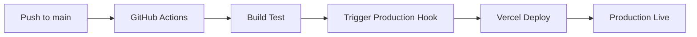
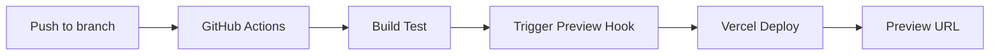
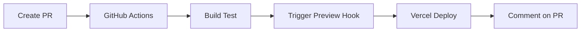

# 🚀 Configuración de Deploy Hooks - AI-RFX Frontend

Esta guía te ayudará a configurar deploy hooks automáticos para el proyecto AI-RFX Frontend usando Vercel y GitHub Actions.

## 🎯 ¿Qué son los Deploy Hooks?

Los Deploy Hooks son URLs especiales que permiten disparar deploys automáticos en Vercel cuando se activan. Esto permite:

- ✅ Deploys automáticos cuando se hace push al repositorio
- ✅ Deploys de preview para pull requests
- ✅ Integración con CI/CD workflows
- ✅ Control granular sobre cuándo y cómo se deploya

## 🏗️ Estructura del Proyecto

Después de la configuración, tendrás:

```
AI-RFX-Frontend/
├── .github/
│   └── workflows/
│       └── vercel-deploy.yml      # Workflow de GitHub Actions
├── scripts/
│   ├── deploy-complete.sh         # Script completo de deploy
│   ├── trigger-deploy-hook.js     # Script para disparar hooks
│   └── check-deploy-status.js     # Script para verificar status
├── vercel.json                    # Configuración de Vercel optimizada
├── ENV_CONFIG.md                  # Documentación de variables de entorno
└── package.json                   # Scripts npm actualizados
```

## 🚀 Configuración Paso a Paso

### Paso 1: Configurar Deploy Hooks en Vercel

1. **Accede a tu proyecto en Vercel**

   ```
   https://vercel.com/dashboard/[tu-usuario]/[proyecto]
   ```

2. **Crear Deploy Hooks**

   - Ve a **Settings** → **Git** → **Deploy Hooks**
   - Crea dos hooks:
     - **Name:** `Production Deploy`  
       **Branch:** `main`
     - **Name:** `Preview Deploy`  
       **Branch:** (leave empty for all branches)

3. **Guardar las URLs**
   ```
   Production: https://api.vercel.com/v1/integrations/deploy/prj_xxx/xxx
   Preview: https://api.vercel.com/v1/integrations/deploy/prj_xxx/xxx
   ```

### Paso 2: Configurar GitHub Secrets

1. **Ve a tu repositorio en GitHub**

   ```
   https://github.com/[usuario]/[repo]/settings/secrets/actions
   ```

2. **Agregar Secrets necesarios:**

   | Secret Name                  | Value                      | Descripción                     |
   | ---------------------------- | -------------------------- | ------------------------------- |
   | `VERCEL_DEPLOY_HOOK_PROD`    | URL del hook de producción | Para deploys de `main`          |
   | `VERCEL_DEPLOY_HOOK_PREVIEW` | URL del hook de preview    | Para otras ramas                |
   | `NEXT_PUBLIC_API_URL`        | URL de tu API              | Variable de entorno             |
   | `VERCEL_TOKEN`               | Tu token de Vercel         | Opcional, para verificar status |

### Paso 3: Configurar Variables de Entorno en Vercel

En tu proyecto de Vercel, ve a **Settings** → **Environment Variables**:

```env
NEXT_PUBLIC_API_URL = https://tu-api.com
NODE_ENV = production
```

### Paso 4: Verificar GitHub Actions

El workflow se activará automáticamente en:

- Push a `main`, `master`, `develop`, `staging`
- Pull requests hacia `main`
- Dispatch manual

## 🎮 Scripts Disponibles

Una vez configurado, tendrás estos comandos:

```bash
# 🚀 Deploy completo (con limpieza)
npm run deploy:complete
./scripts/deploy-complete.sh --prod    # Producción
./scripts/deploy-complete.sh --preview # Preview

# 🎯 Deploy directo con Vercel CLI
npm run deploy          # Producción
npm run deploy:preview  # Preview

# 🔗 Disparar deploy hooks manualmente
npm run hook:trigger
DEPLOY_HOOK_URL=https://... npm run hook:trigger

# 🔍 Verificar estado de deploys
npm run check:status
VERCEL_TOKEN=xxx npm run check:status

# 🧹 Limpiar caché
npm run clean
```

## ⚡ Flujo Automático Configurado

### Push a Rama Principal (main/master)



### Push a Otras Ramas



### Pull Request



## 🔧 Personalización

### Modificar Ramas para Deploy

Edita `.github/workflows/vercel-deploy.yml`:

```yaml
on:
  push:
    branches:
      - main
      - staging # Agregar más ramas
      - hotfix/* # Patrones de rama
```

### Agregar Validaciones Pre-Deploy

En el workflow, antes del deploy:

```yaml
- name: Run Tests
  run: npm test

- name: Type Check
  run: npm run type-check

- name: Security Audit
  run: npm audit --audit-level high
```

### Configurar Notificaciones

Agregar notificaciones a Slack, Discord, etc:

```yaml
- name: Notify Slack
  if: success()
  uses: 8398a7/action-slack@v3
  with:
    status: success
    webhook_url: ${{ secrets.SLACK_WEBHOOK }}
```

## 🔍 Monitoreo y Debugging

### Ver Logs de GitHub Actions

```
https://github.com/[usuario]/[repo]/actions
```

### Ver Logs de Vercel

```
https://vercel.com/[usuario]/[proyecto]/deployments
```

### Verificar Status Programáticamente

```bash
# Verificar último deploy
npm run check:status

# Con token específico
VERCEL_TOKEN=tu_token npm run check:status mi-proyecto
```

## ⚠️ Troubleshooting

### Error: "Hook URL inválido"

- ✅ Verifica que la URL del hook sea correcta
- ✅ Comprueba que el secret esté configurado en GitHub

### Error: "Build failed"

- ✅ Revisa variables de entorno en Vercel
- ✅ Verifica dependencias en `package.json`
- ✅ Comprueba los logs de build

### Error: "Authentication failed"

- ✅ Regenera el token de Vercel
- ✅ Actualiza el secret `VERCEL_TOKEN`

### Deploy no se activa

- ✅ Verifica que el workflow esté en rama `main`
- ✅ Comprueba que el push active las condiciones
- ✅ Revisa permisos del repositorio

## 🔐 Seguridad

### Buenas Prácticas

- ✅ Usa GitHub Secrets para URLs y tokens
- ✅ No hardcodees credenciales en código
- ✅ Limita permisos del token de Vercel
- ✅ Revisa regularmente los access logs

### Headers de Seguridad

El `vercel.json` incluye headers de seguridad:

- `X-Content-Type-Options: nosniff`
- `X-Frame-Options: DENY`
- `X-XSS-Protection: 1; mode=block`

## 📊 Métricas y Analytics

### Tracking de Deploys

- Deploy frequency por rama
- Tiempo promedio de deploy
- Success rate de builds
- Performance metrics

### Configurar Vercel Analytics

```env
NEXT_PUBLIC_VERCEL_ANALYTICS_ID=prj_xxx
```

## 🚀 Siguientes Pasos

1. **Configurar Staging Environment**

   - Crear rama `staging`
   - Hook separado para staging
   - Variables de entorno específicas

2. **Agregar Testing Automatizado**

   - Unit tests
   - Integration tests
   - E2E tests con Playwright/Cypress

3. **Monitoreo Avanzado**

   - Sentry para error tracking
   - Performance monitoring
   - Uptime monitoring

4. **Optimizaciones**
   - CDN configuration
   - Cache strategies
   - Bundle analysis

## 📞 Soporte

Para problemas o preguntas:

1. Revisa esta documentación
2. Consulta logs en GitHub Actions y Vercel
3. Verifica configuración de secrets
4. Consulta [Documentación de Vercel](https://vercel.com/docs)

---

**✨ Tu proyecto ahora está configurado para deploy hooks automáticos!**

Cada push activará el pipeline de deploy automático, manteniendo tu aplicación siempre actualizada. 🎉
